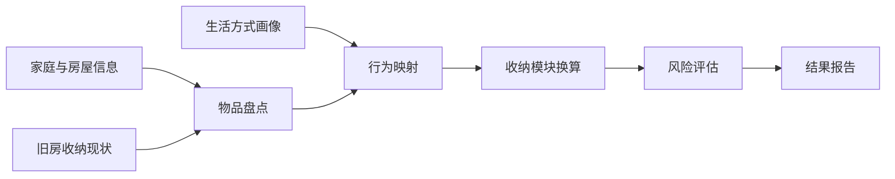
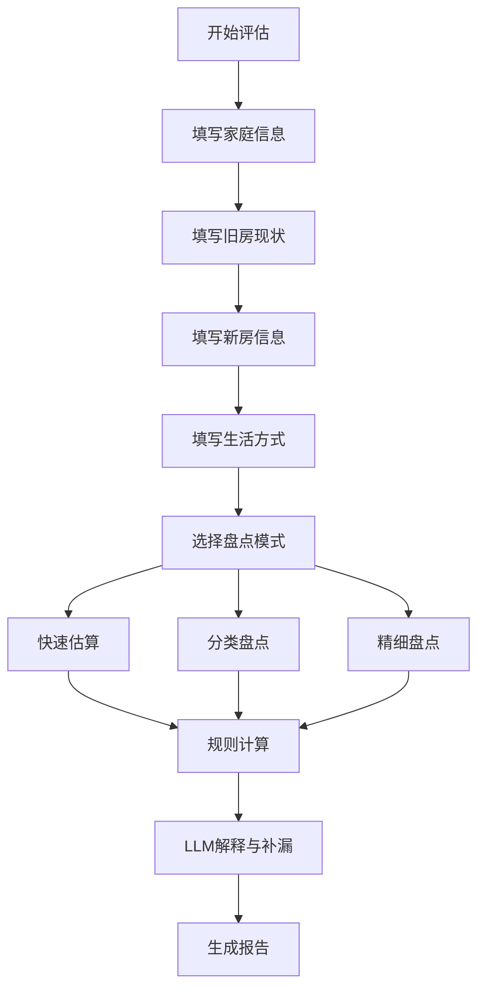
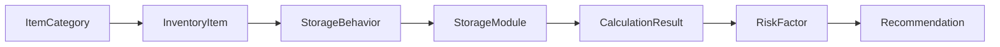
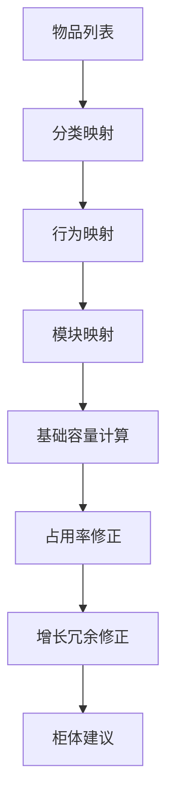

# Home Storage Planner PRD（V1 补充版）

## 1. 项目背景与定位

Home Storage Planner 是一个面向装修前家庭的收纳空间评估工具。它不是传统意义上的柜体生成器，也不是效果图软件，而是一个基于真实家庭物品、生活方式和未来增长预期的收纳需求量化系统。

用户在装修新房时，常见决策方式依赖设计师经验、全屋定制销售建议或主观感觉，容易出现以下问题：

- 装修前无法判断柜体是否足够。
- 旧房物品迁移到新房后才发现收纳不足。
- 高频物品、低频物品和大件物品被混在一起估算。
- 儿童、宠物、数码设备、囤货、兴趣爱好等增长因素没有提前预留。
- 柜体设计只关注尺寸和颜值，缺乏对真实生活物品的量化依据。

V1 的核心定位是：

> 用户通过家庭信息、旧房现状、生活方式和分类物品盘点，系统将物品转换为标准收纳模块，输出新房所需的收纳容量、柜体建议、空间优先级和风险报告，帮助用户在装修阶段与设计师或定制柜商进行更清晰的沟通。

## 2. V1 产品目标

### 2.1 核心目标

V1 需要完成一个最小闭环：



系统需要帮助用户回答四个问题：

1. 我家现在到底有多少东西需要收纳？
2. 新房至少需要多少有效收纳空间？
3. 哪些柜体、模块或空间最应该优先保留？
4. 哪些物品类型在未来最容易爆仓？

### 2.2 V1 输出目标

V1 应输出：

- 总收纳需求体积。
- 推荐柜体毛体积。
- 分空间、分品类的收纳需求。
- 标准收纳模块数量。
- 柜体长度、组数或类型建议。
- 收纳冗余率建议。
- 风险报告。
- 给设计师或定制柜商的沟通清单。

## 3. V1 范围与不做事项

### 3.1 V1 做什么

V1 聚焦“手动盘点 + 规则换算 + 风险解释”。

具体包括：

- 家庭基础信息录入。
- 旧房收纳现状录入。
- 新房基础信息录入。
- 生活方式画像录入。
- 分类物品数量录入。
- 使用频率、收纳行为和生命周期选择。
- 标准收纳模块换算。
- 柜体容量和长度建议。
- 容量、增长、拿取、大件、囤货和阶段变化风险评估。
- LLM 生成解释、补漏提醒和沟通建议。

### 3.2 V1 不做什么

V1 明确不做：

- 不做 CAD 级精确绘图。
- 不做自动柜体布局。
- 不做平面图导入和识别。
- 不做 LiDAR、图片、视频识别。
- 不做电商订单接入。
- 不做全屋定制报价。
- 不保证毫米级柜体尺寸。
- 不替代设计师做最终柜体结构设计。

V1 的结果是“装修前收纳需求评估”，不是“可直接下单生产的柜体图纸”。

## 4. 目标用户与典型场景

### 4.1 核心用户

- 60㎡ 到 120㎡ 的中小户型家庭。
- 正在装修新房或准备装修的用户。
- 从旧房搬到新房，希望提前评估收纳容量的用户。
- 日式、极简、无主灯、整洁风格偏好的用户。
- 对杂物、囤货、孩子用品或数码设备感到焦虑的用户。

### 4.2 高价值用户

- 一线和新一线城市高密度住宅用户。
- 有孩子或计划生育的家庭。
- 有宠物的家庭。
- 数码设备、摄影、露营、运动、手办等兴趣爱好多的用户。
- 室内设计师、收纳咨询师、定制家具顾问。

### 4.3 典型使用场景

- 用户准备与设计师沟通柜体方案前，先生成一份收纳需求报告。
- 用户纠结岛台、餐边柜、家政柜、储物间之间的取舍，需要量化依据。
- 用户旧房已经爆仓，希望知道新房该补哪些柜体。
- 用户计划生育或家庭成员增加，希望提前预留儿童用品空间。
- 用户有大量数码设备、包装盒和线材，希望避免新房继续堆积。

## 5. 用户流程

### 5.1 总体流程



### 5.2 输入步骤

1. 家庭信息
   - 当前家庭人数。
   - 是否有孩子。
   - 是否计划生育。
   - 是否有宠物。
   - 是否在家办公。
   - 未来 3 年常住人数变化。

2. 旧房现状
   - 旧房面积。
   - 旧房户型。
   - 当前柜体是否够用。
   - 当前爆仓区域。
   - 当前临时堆放区域。
   - 是否计划断舍离。

3. 新房信息
   - 新房面积。
   - 新房户型。
   - 是否有独立储物间。
   - 是否有玄关柜、餐边柜、家政柜、阳台柜、衣帽间等规划。
   - 用户愿意为收纳牺牲哪些空间。

4. 生活方式画像
   - 囤货程度。
   - 极简程度。
   - 做饭频率。
   - 旅行频率。
   - 数码设备密度。
   - 兴趣爱好数量。
   - 换季衣物量。

5. 物品盘点
   - 快速估算：基于家庭画像和户型生成默认物品基线。
   - 分类盘点：按品类填写数量。
   - 精细盘点：为重点品类填写尺寸、使用频率、是否增长、是否需要展示。

6. 结果确认
   - 用户查看估算结果。
   - 系统提示可能遗漏的物品。
   - 用户可以补充或调整。
   - 系统生成最终报告。

## 6. 旧房到新房对照模型

旧房信息是 V1 的关键输入，因为用户真正想解决的问题不是抽象的“我需要多少收纳”，而是：

> 现在这些东西搬到新房后，新房是否装得下，并且是否更好用？

### 6.1 旧房字段

| 字段 | 类型 | 说明 |
| --- | --- | --- |
| oldHomeArea | number | 旧房建筑或套内面积 |
| oldHomeLayout | enum | 一居、两居、三居、四居及以上 |
| oldStorageSatisfaction | enum | 充足、刚好、不足、严重不足 |
| overflowZones | multi-select | 爆仓区域，如卧室、厨房、阳台、玄关 |
| temporaryStorageZones | multi-select | 临时堆放区域，如沙发旁、床底、餐桌、地面 |
| currentCabinetTypes | multi-select | 当前已有柜体类型 |
| currentCabinetLength | number | 当前可估算柜体总长度 |
| declutterIntent | level | 搬家前断舍离意愿 |
| declutterRatio | percentage | 预计减少物品比例 |

### 6.2 新房字段

| 字段 | 类型 | 说明 |
| --- | --- | --- |
| newHomeArea | number | 新房建筑或套内面积 |
| newHomeLayout | enum | 一居、两居、三居、四居及以上 |
| hasStorageRoom | boolean | 是否有独立储物间 |
| plannedCabinetZones | multi-select | 已计划柜体区域 |
| flexibleZones | multi-select | 可调整空间，如岛台、书房、阳台 |
| storagePriority | enum | 外观优先、均衡、收纳优先 |
| cabinetDepthPreference | enum | 浅柜为主、标准柜、深柜可接受 |

### 6.3 对照逻辑

系统需要比较：

- 新房面积相对旧房是否增加。
- 新房可用收纳区域是否增加。
- 旧房爆仓品类是否在新房获得专门空间。
- 旧房临时堆放物品是否有明确归属。
- 断舍离比例是否足以抵消未来增长。

输出示例：

- “旧房厨房和阳台均存在爆仓，新房如果不设置家政柜，清洁工具和囤货将继续外溢。”
- “新房面积增加 18%，但常住人数计划增加，建议收纳冗余率不低于 35%。”
- “如果取消餐边柜，需要将小家电和餐具收纳转移到厨房高柜或岛台下柜。”

## 7. 输入模型

### 7.1 家庭基础信息

| 字段 | 类型 | 示例 |
| --- | --- | --- |
| householdSize | number | 2 |
| hasChildren | boolean | false |
| plansForChildren | boolean | true |
| hasPets | boolean | true |
| worksFromHome | boolean | true |
| expectedHouseholdGrowth | enum | 无、可能增加、明确增加 |
| timeHorizon | enum | 1 年、3 年、5 年 |

### 7.2 生活方式画像

| 字段 | 类型 | 说明 |
| --- | --- | --- |
| stockpilingLevel | 1-5 | 囤货程度 |
| minimalismLevel | 1-5 | 极简程度 |
| cookingFrequency | 1-5 | 做饭频率 |
| travelFrequency | 1-5 | 旅行频率 |
| digitalDeviceLevel | 1-5 | 数码设备密度 |
| hobbyStorageLevel | 1-5 | 兴趣爱好占用空间 |
| seasonalClothingLevel | 1-5 | 换季衣物压力 |

### 7.3 物品输入字段

| 字段 | 类型 | 说明 |
| --- | --- | --- |
| itemName | string | 物品名称 |
| categoryId | string | 所属分类 |
| quantity | number | 数量 |
| unit | enum | 件、双、个、箱、组 |
| sizePreset | enum | 小、中、大、超大、自定义 |
| customDimensions | object | 长宽高，可选 |
| usageFrequency | enum | 高频、中频、低频、超低频 |
| storageBehavior | enum | 挂放、折叠、竖放、展示、隐藏、临时放置 |
| lifecycleType | enum | 稳定型、增长型、周期型、阶段型 |
| targetRoom | enum | 玄关、客厅、厨房、卧室、阳台、储物间等 |

### 7.4 核心数据模型

V1 的数据模型需要保证计算结果可追溯。每一条推荐都应能追溯到用户输入、物品分类、行为映射或风险规则。

| 模型 | 关键字段 | 作用 |
| --- | --- | --- |
| ItemCategory | id、parentId、name、defaultBehavior、defaultLifecycle | 定义物品分类树和默认收纳行为 |
| InventoryItem | categoryId、quantity、unit、sizePreset、customDimensions、usageFrequency | 记录用户输入的物品数量和属性 |
| StorageBehavior | behaviorType、accessLevel、heightRequirement、depthRequirement | 描述物品如何被拿取和收纳 |
| StorageModule | moduleId、dimensions、effectiveCapacity、supportedBehaviors | 定义标准收纳模块和可用容量 |
| CalculationResult | itemId、moduleId、moduleCount、grossVolume、effectiveVolume、redundancyRate | 记录物品到模块的换算结果 |
| RiskFactor | riskType、level、evidence、suggestion | 记录风险类型、等级、依据和建议 |
| Recommendation | targetZone、cabinetType、moduleList、priority、tradeoff | 生成面向装修沟通的柜体建议 |

核心关系如下：



## 8. 物品分类体系

V1 需要一套稳定的分类体系，避免用户输入过散，也方便后续规则计算。

| 一级分类 | 二级分类 | 典型物品 |
| --- | --- | --- |
| 衣物 | 长挂衣物 | 大衣、风衣、长裙、礼服 |
| 衣物 | 短挂衣物 | 衬衫、夹克、西装、短外套 |
| 衣物 | 折叠衣物 | T 恤、卫衣、针织衫、家居服 |
| 衣物 | 小件衣物 | 内衣、袜子、围巾、帽子 |
| 衣物 | 换季衣物 | 厚被、羽绒服、季节性衣物 |
| 鞋包 | 常穿鞋 | 运动鞋、通勤鞋、拖鞋 |
| 鞋包 | 季节鞋 | 靴子、凉鞋 |
| 鞋包 | 箱包 | 双肩包、手提包、旅行包 |
| 厨房 | 餐具 | 碗、盘、杯、刀叉 |
| 厨房 | 锅具 | 炒锅、汤锅、蒸锅、烤盘 |
| 厨房 | 小家电 | 电饭煲、空气炸锅、咖啡机、破壁机 |
| 厨房 | 食品囤货 | 米面粮油、零食、调味品 |
| 家政 | 清洁工具 | 吸尘器、拖把、扫把、清洁刷 |
| 家政 | 洗护囤货 | 洗衣液、纸品、清洁剂 |
| 家政 | 工具杂物 | 工具箱、梯子、维修用品 |
| 数码 | 设备 | 电脑、平板、相机、游戏机、VR |
| 数码 | 配件 | 线材、充电器、移动硬盘、支架 |
| 数码 | 包装盒 | 设备包装盒、说明书、保修卡 |
| 文件纪念 | 文件资料 | 证件、合同、票据、说明书 |
| 文件纪念 | 纪念物 | 相册、礼物、收藏品 |
| 大件低频 | 行李箱 | 登机箱、托运行李箱 |
| 大件低频 | 运动露营 | 球拍、瑜伽垫、帐篷、露营箱 |
| 儿童宠物 | 儿童用品 | 玩具、绘本、推车、尿布囤货 |
| 儿童宠物 | 宠物用品 | 猫砂、猫粮、宠物玩具、航空箱 |

## 9. 收纳行为与模块模型

### 9.1 使用频率模型

| 等级 | 定义 | 收纳原则 |
| --- | --- | --- |
| 高频 | 每天使用 | 放在腰部到视线高度，路径短，拿取少阻碍 |
| 中频 | 每周使用 | 可放在常规柜体中部或下部 |
| 低频 | 每月使用 | 可放在高柜、深柜、床下或储物间 |
| 超低频 | 季度以上 | 可放在高位、深处或集中储物区 |

### 9.2 收纳行为模型

| 行为 | 特征 | 典型物品 | 计算重点 |
| --- | --- | --- | --- |
| 挂放 | 需要连续高度和挂杆长度 | 长外套、衬衫 | 挂杆长度、高度 |
| 折叠 | 需要抽屉或层板 | T 恤、卫衣 | 堆叠层数、抽屉数量 |
| 竖放 | 需要深度和稳定性 | 行李箱、清洁工具 | 柜体深度、高度 |
| 展示 | 需要可视面和防尘 | 手办、相机、收藏品 | 开放格或玻璃柜 |
| 隐藏 | 需要封闭柜体 | 囤货、杂物、包装盒 | 容积、分类箱 |
| 临时放置 | 需要浅层和便利位置 | 钥匙、包、快递 | 玄关台面、开放格 |

### 9.3 生命周期模型

| 类型 | 定义 | 示例 | 处理方式 |
| --- | --- | --- | --- |
| 稳定型 | 数量长期稳定 | 证件、常用餐具 | 按当前量加基础冗余 |
| 增长型 | 会持续增加 | 数码配件、收藏、书籍 | 增加增长系数 |
| 周期型 | 季节性变化明显 | 换季衣物、被褥 | 增加季节峰值容量 |
| 阶段型 | 与人生阶段相关 | 儿童用品、宠物用品 | 按未来阶段预留 |

### 9.4 标准收纳模块

| 模块 | 推荐尺寸（cm） | 适用物品 | 说明 |
| --- | --- | --- | --- |
| shortHangModule | 80×60×100 | 衬衫、短外套、西装 | 适合短挂衣物 |
| longHangModule | 80×60×150 | 大衣、长裙、风衣 | 需要连续高度 |
| drawerModule | 60×45×20 | 内衣、袜子、小件 | 高频小件优先 |
| shelfModule | 80×45×35 | 折叠衣物、文件 | 标准层板模块 |
| deepStorageModule | 60×60×240 | 行李箱、大件杂物 | 低频大件 |
| housekeepingModule | 80×60×240 | 吸尘器、拖把、清洁剂 | 家政集中收纳 |
| shoeModule | 80×35×100 | 常穿鞋、季节鞋 | 受层高和深度影响 |
| applianceModule | 80×60×90 | 小家电、锅具 | 厨房或餐边柜 |
| digitalModule | 60×45×120 | 数码设备、线材 | 需要分格和防尘 |
| displayModule | 80×35×120 | 收藏、手办、相机 | 展示与防尘并重 |

## 10. 核心计算逻辑

### 10.1 基础计算原则

系统需要区分三类容量：

- 物品净体积：物品本身占用的几何体积。
- 模块有效容量：一个模块真正可用于收纳的容量。
- 柜体毛体积：柜体外部尺寸对应的总体积。

默认规则：

- 柜体有效使用率不超过 70%。
- 高频物品不使用满载深柜计算。
- 增长型物品增加 20% 到 50% 增长冗余。
- 阶段型物品根据家庭计划增加独立预留。
- 大件物品优先按连续空间判断，而不是只按体积判断。

### 10.2 计算流程



### 10.3 规则样例

| 品类 | 输入 | 映射逻辑 | 输出 |
| --- | --- | --- | --- |
| 短挂衣物 | 件数 | 每 35 到 45 件约需 1 个短挂模块 | 短挂模块数量、衣柜长度 |
| 长挂衣物 | 件数 | 每 18 到 25 件约需 1 个长挂模块 | 长挂模块数量、连续挂放高度 |
| 折叠衣物 | 件数 | 按每层 8 到 12 件估算层板或抽屉 | 层板数、抽屉数 |
| 内衣袜子 | 组数 | 每 40 到 60 件约需 1 个抽屉模块 | 抽屉数量 |
| 常穿鞋 | 双数 | 每 12 到 16 双约需 1 个鞋柜模块 | 鞋柜模块数量 |
| 靴子 | 双数 | 按高层板或竖向空间计算 | 高层鞋柜空间 |
| 行李箱 | 个数和尺寸 | 优先判断是否需要 60cm 深连续高柜 | 深收纳模块数量 |
| 小家电 | 个数和尺寸 | 按 80×60×90 模块估算 | 厨房高柜或餐边柜容量 |
| 清洁工具 | 件数 | 吸尘器、拖把、扫把需竖向家政模块 | 家政柜数量 |
| 数码设备 | 件数和包装盒 | 设备、配件、包装盒分开估算 | 数码模块、文件格 |

### 10.4 冗余率建议

| 情况 | 推荐冗余率 |
| --- | --- |
| 极简、无增长预期 | 20% |
| 普通两人家庭 | 30% |
| 有囤货倾向 | 35% 到 45% |
| 有孩子或计划生育 | 40% 到 60% |
| 兴趣爱好多、数码设备多 | 40% 到 60% |
| 旧房严重爆仓 | 50% 以上 |

## 11. 风险评估规则

### 11.1 风险维度

| 风险 | 判断依据 | 输出示例 |
| --- | --- | --- |
| 容量风险 | 推荐容量高于计划柜体容量 | “当前规划柜体可能不足 4.2m³” |
| 增长风险 | 增长型物品占比高 | “数码配件和儿童用品存在持续增长风险” |
| 高频拿取风险 | 高频物品被分配到低便利空间 | “高频清洁工具不适合放在阳台深处” |
| 大件连续空间风险 | 行李箱、工具、露营用品缺少连续空间 | “建议保留至少 1 组 60cm 深高柜” |
| 囤货风险 | 食品、纸品、洗护库存高 | “厨房和家政收纳需要预留囤货区” |
| 阶段变化风险 | 生育、宠物、在家办公等变化 | “计划生育会显著增加阶段型收纳压力” |

### 11.2 风险等级

风险等级分为低、中、高。

- 低：现有规划基本覆盖需求，只有局部优化建议。
- 中：存在一到两个明显不足，建议装修前调整柜体方案。
- 高：多个关键品类没有归属，或推荐容量明显高于计划容量。

### 11.3 风险评分建议

系统可以采用 100 分制：

- 90 到 100：收纳规划充足。
- 75 到 89：基本充足，有局部风险。
- 60 到 74：存在明显风险，需要调整。
- 60 以下：高风险，建议重新规划柜体或减少物品。

评分由以下维度组成：

| 维度 | 权重 |
| --- | --- |
| 总容量匹配度 | 35% |
| 高频物品便利性 | 20% |
| 大件连续空间 | 15% |
| 未来增长冗余 | 20% |
| 爆仓区域修复度 | 10% |

## 12. 输出结果与页面结构

### 12.1 结果页结构

结果页建议分为六个区域：

1. 总览卡片
   - 收纳评分。
   - 当前风险等级。
   - 总需求体积。
   - 推荐柜体毛体积。
   - 推荐冗余率。

2. 分空间需求
   - 玄关。
   - 客厅。
   - 厨房。
   - 卧室。
   - 阳台。
   - 储物间。

3. 柜体建议
   - 衣柜长度。
   - 鞋柜模块。
   - 餐边柜或厨房高柜。
   - 家政柜。
   - 深收纳柜。
   - 数码/文件柜。

4. 风险报告
   - 高风险项。
   - 中风险项。
   - 风险原因。
   - 调整建议。

5. 空间优先级建议
   - 优先保留空间。
   - 可牺牲空间。
   - 不建议压缩的空间。

6. 设计师沟通清单
   - 必须预留的柜体。
   - 需要连续空间的大件。
   - 高频物品位置要求。
   - 可接受的取舍方案。

### 12.2 输出示例

```text
收纳评分：72 / 100
风险等级：中高

总物品净需求：18.6m³
推荐柜体毛体积：24.0m³
推荐冗余率：38%

核心建议：
1. 保留至少 1 组家政柜，用于吸尘器、清洁工具和洗护囤货。
2. 衣柜建议不少于 5.2 米，其中长挂区不少于 1.6 米。
3. 行李箱和露营物品需要 1 组 60cm 深高柜。
4. 如果取消餐边柜，小家电将挤占厨房台面和高柜空间。
```

## 13. LLM 职责边界

### 13.1 LLM 不负责

- 不负责精确数学计算。
- 不负责柜体生产尺寸。
- 不负责 CAD 图纸绘制。
- 不负责自动判断所有物品尺寸。
- 不负责替代规则引擎决定模块数量。

### 13.2 LLM 负责

- 根据用户回答识别可能遗漏的物品。
- 解释风险产生的原因。
- 将计算结果翻译成装修沟通语言。
- 根据生活方式推断隐藏需求。
- 生成设计师沟通清单。
- 提醒用户不同取舍的后果。

### 13.3 LLM 输出约束

LLM 生成的建议必须引用规则计算结果或用户输入，不应凭空给出容量数字。

示例：

- 合格：“由于你填写了 3 个行李箱和 2 个露营箱，系统建议保留 1 组深收纳模块。”
- 不合格：“我觉得你需要更多柜子。”

## 14. V1 成功指标

### 14.1 用户侧指标

- 用户能在 15 分钟内完成一次快速估算。
- 用户能在结果中识别至少 3 个原本遗漏的收纳需求。
- 用户认为报告可以用于和设计师沟通。
- 用户愿意根据报告调整至少 1 个柜体方案。

### 14.2 产品侧指标

- 快速估算完成率不低于 70%。
- 分类盘点完成率不低于 50%。
- 结果页停留时长高于普通问卷页。
- 报告导出或分享率达到可验证水平。
- 用户修改输入后能够看到结果变化，形成反馈闭环。

### 14.3 准确性指标

- 用户主观评价“基本符合我家情况”的比例不低于 70%。
- 设计师或收纳顾问认为报告有参考价值的比例不低于 60%。
- 高频物品、大件物品、家政物品的遗漏率持续下降。

## 15. 未来版本规划

### V2：平面图联动

- 支持户型图导入。
- 自动识别空间类型。
- 将收纳模块映射到房间。
- 初步判断柜体放置位置和动线影响。

### V3：3D 与白模联动

- 支持 Blender 或类似工具生成白模。
- 模拟柜体体量。
- 支持第一人称动线检查。
- 展示收纳容量与空间压迫感的关系。

### V4：AI Agent 长期规划

- 记录消费习惯。
- 识别物品增长趋势。
- 根据家庭阶段动态调整收纳模型。
- 为下一次装修、搬家或断舍离提供持续建议。

## 16. MVP 验证建议

V1 上线前可以先用低成本方式验证：

1. 用表单收集家庭信息和物品数量。
2. 用规则表完成模块换算。
3. 用固定模板生成结果报告。
4. 邀请 5 到 10 个真实装修用户试用。
5. 观察用户是否会根据报告调整柜体方案。

如果用户愿意把报告发给设计师，或者能基于报告发现遗漏空间，说明产品方向具备继续迭代价值。
